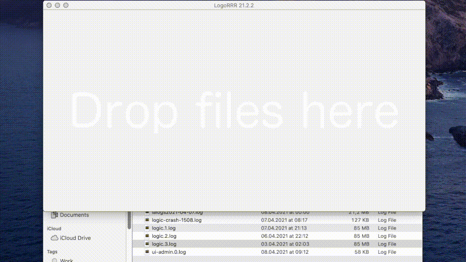

# LogoRRR

LogoRRR is a simple utility to display a logfile and visualise certain classes of events. 

For example, ERROR events are visualized as red rectangles, TRACE events as grey rectangles, INFO events as green ones etc. 

## Motivation

This project serves as a vehicle to test and learn about various aspects of JavaFX GraalVM compilation. [This blog post](https://ladstatt.blogspot.com/2020/10/compile-scala-javafx-application-with.html) was written to accompany the initial public release of this github repository, describing challenges performing AOT with GraalVM and the surrounding tooling.

## Binary download 

You can give it a try by downloading a [prebuilt binary for LogoRRR](https://github.com/rladstaetter/LogoRRR/releases/tag/21.2.4) from the releases page.

However, since the application is not digitally signed with a code signing certificate, you'll see warnings not to start the application or your computer will blow up. Until I pay much money to be able to sign the application, we have to live with this and you have to explicitly allow the application to to start. Sorry about that. 🤷🏼‍♂️ 

Even worse, on MAC you'll have to give the application rights to be executed which can be done in a terminal with the command

    chmod 755 app.logorrrr

Afterwards you have to specify in your preferences menu that you allow to start this application. Finally then you can start it via command line. I didn't yet figure out what has to be done to package an application in way that you can launch it via mouse click. Anyway, it should be put into a the apple app store - the same applies to the Windows platform ... 

Speaking of the latter, on windows you can start it via mouse click, but you'll be warned by a nag screen not to open it ... 

## Prerequisites

You have to download a recent GraalVM installation package (I've tested it with 21.0.0.r11) and a maven distribution (everything starting from 3.6.3 should work).

Currently this application can analyze log files which were generated by `java.util.logging`. The log output is dependent on your locale, you can override settings by providing `-Duser.language=en` as JVM parameter for your application.

## Usage

You can start LogoRRR via double click from the desktop. Add a log file simply via drag'n drop.

Alternatively, you can start LogoRRR via command line and provide the path to the log file as command line parameter (or multiple at once if you like).

## Building

Given you have followed the instructions for [maven-gluonfx-plugin](https://github.com/gluonhq/gluonfx-maven-plugin) you only have to provide the path to your GraalVM installation in the main pom.xml found at the root folder of the project.

### MacOs X

Following commands should get you a working environment. This is a fast way to install everything you'll need as far as I remember. 

    git clone https://github.com/rladstaetter/LogoRRR.git
    curl -s "https://get.sdkman.io" | bash
    sdk install maven 3.8.1
    sdk install java 21.1.0.r11-grl

(https://sdkman.io is a package manager specifically tailored for java development, you can install various JVM based utilities / libraries and tools with it, manage different JVM versions as well - very handy!)

After this initial setup, you should be ready to build via maven. You have to adapt some paths in `pom.xml` - just search for `graalvm.home` and make sure it is pointing to the correct path.

Execute

     mvn clean package

in the project directory (where `pom.xml` is located).

After spending some time compiling all necessary modules a binary executable which can be run without a JVM should be 
available here:

    ./dist/dist-osx/binary-osx/target/gluonfx/x86_64-darwin/app.logorrr.dist.osx.binary

Try it out!

### Windows 

To setup your Windows development environment, you have to perform following steps:

- Visual Studio 2019 (Community Edition should suffice, tested with Visual Studio Professional)
- GraalVM in a recent version (at least [21.1.0](https://github.com/graalvm/graalvm-ce-builds/releases/tag/vm-21.1.0)), for the moment stick to JDK 11 based version
- put GraalVM in your Path
- As Administrator, execute 'gu install native-image' in a 'x64 Native Tools command prompt' - which will be available if you have Visual Studio installed.
- for normal compilation, you don't need administrator rights. 

After setting `graalvm.home` in the main pom.xml to your GraalVM Installation directory all you have to do to get to a binary is:

     mvn clean package

A binary is available here after some minutes:
    
    target\gluonfx\x86_64-windows\logorrr.exe

If you want to execute this exe on another computer, you have to make sure that the Visual Studio runtime environment is present there. If not, you can download [Visual Studio 2019 redistributables here](https://aka.ms/vs/16/release/vc_redist.x64.exe). (If you are lucky its already installed on your machine). If the application doesn't start - this is a possible reason for that.  

## Running from IntelliJ

Running JavaFX applications in IntelliJ needs a some more work if you work with modularized Java. There are builds of Java which incorporate JavaFX (from Azul for example) where following steps are not necessary. However, if you use GraalVM or AdoptOpenJDK builds, you have to provide special VM Parameters in order to start a JavaFX application from your IDE. 

As such, you have to provide following parameters:

    --module-path <path to your javafx sdk lib directory> --add-modules javafx.controls,javafx.fxml

For me following settings work:

    --module-path /Users/lad/gh/javafx-sdk-16/lib --add-modules javafx.controls,javafx.fxml

Note that you have to download this javafx-sdk separately and install it once on your computer, you can get it on [Gluon's Download Page for JavaFX](https://gluonhq.com/products/javafx/). 

A comprehensive tutorial how to get started with developing JavaFX can be found on [openjfx.io](https://openjfx.io). 

## Configuring GraalVM native-image 

`gluonfx-maven-plugin` helps to configure GraalVM compilation by providing a command which creates a configuration for 
`native-image` by analysing the runtime behavior of an application. Just issue following maven command on your command line:

    mvn gluonfx:runagent

It will start LogoRRR. Now you have to execute all possible click paths - in your code repository configuration files will appear in `src/main/resources/META-INF/native-image/`. Those files are different depending on which OS you execute the application. 

Currently, those files are generated / checked in under src/main/native-image/<os>/, and via a maven configuration they are placed in the right place needed for native-image. Like this the project can be build on multiple platforms via 

    mvn package 

Implicitly, maven package will call `gluonfx:build` and create a binary executable. (On Windows the binary will be packed via [UPX](https://upx.github.io) to reduce the file size considerably.)

## Features

- drag and drop log files to application to visualize/view them
- handle multiple log files in parallel
- filter log files for entries interactively
- basic search functionality
- Unix `tail -f` like functionality to watch ongoing events

## License

This software is licensed under Apache-2 License.
