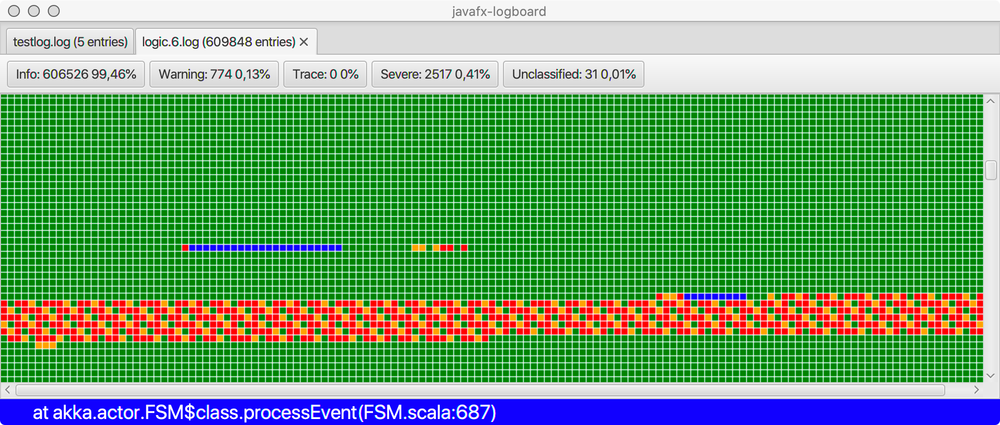

# javafx logboard

JavaFX logboard is a simple utility to display a logfile and visualise certain classes of events. 

For example, ERROR events are visualized as red rectangles, TRACE events as grey rectangles, INFO events as green ones etc. 

The idea is to start this application and simply drag'n drop a logfile to it.

## Motivation

This project serves as a vehicle to test and learn about various aspects of JavaFX GraalVM compilation.

## Prerequisites

You have to download a recent GraalVM installation package (I've tested it with 21.0.0.r11) and a maven distribution
(everything starting from 3.6.3 should work).

## Building

Given you have followed the instructions for [maven-client-plugin](https://github.com/gluonhq/client-maven-plugin) you only have to provide the path to your GraalVM installation in the main pom.xml found at the root folder of the project.

After that, execute following commands:

     mvn clean install
     
After some compiling you should be able to call the native binary in the target folder.

For MacOsX:

    ./binary/target/client/x86_64-darwin/net.ladstatt.logboard.binary
    
For Windows:
    
    binary\target\client\x86_64-windows\net.ladstatt.logboard.binary.exe
    
There are many ways to improve this application, it was primarily written to learn about GraalVM and JavaFX. For more details, check out [this blog post](https://ladstatt.blogspot.com/2020/10/compile-scala-javafx-application-with.html) which elaborates on some details of this project. 
     