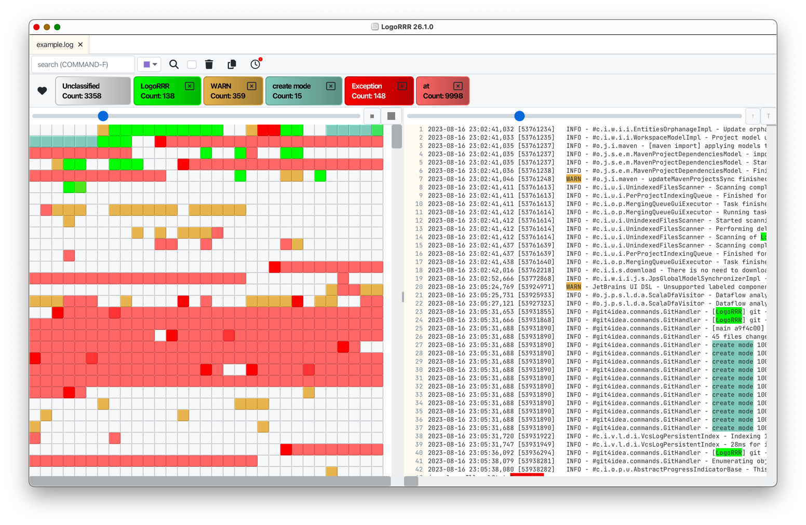

# `LogoRRR`

<table>
  <tr>
    <td>

</td>
<td>

</td>
<td>

</td>
<td>

</td>
</tr>
</table>

LogoRRR is a powerful desktop application designed to simplify the analysis of text files for recurring patterns.
Whether you’re searching for specific events in log files or analysing any other type of text file, LogoRRR makes the
process effortless and efficient.

* **Easy Pattern Recognition**: Quickly identify recurring patterns in your text files.
* **Versatile Application**: Perfect for log file analysis, but adaptable to any text file.
* **User-Friendly Interface**: Designed with simplicity and ease of use in mind.

Visit the [www.logorrr.app](https://www.logorrr.app/) for more information.

## Standalone installers

If you don't want to use app stores, installers are provided also for following platforms:

<table>
<tr>
<th>Platform</th>
<th>Installer</th>
</tr>

<tr>
<td>Windows</td>
<td>

[LogoRRR Windows 10+ Installer, x64, msi](https://github.com/rladstaetter/LogoRRR/releases/download/26.1.0/LogoRRR-26.1.0-installer.msi)

</td>
</tr>

<tr>
<td>Windows</td>
<td>

[LogoRRR Windows 10+ Installer, x64, exe](https://github.com/rladstaetter/LogoRRR/releases/download/26.1.0/LogoRRR-26.1.0-installer.exe)

</td>
</tr>

<tr>
<td>Linux</td>
<td>

[LogoRRR x64 Linux Installer, .deb](https://github.com/rladstaetter/LogoRRR/releases/download/26.1.0/logorrr_26.1.0_amd64.deb)

</td>
</tr>

<tr>
<td>Linux</td>
<td>

[LogoRRR aarch Linux Installer, .deb](https://github.com/rladstaetter/LogoRRR/releases/download/26.1.0/logorrr_26.1.0_arm64.deb)

</td>
</tr>

</table>

## Release Notes 

[Click here](https://github.com/rladstaetter/LogoRRR/releases/tag/26.1.0) to view the [release notes](https://github.com/rladstaetter/LogoRRR/releases/tag/26.1.0) of the latest release.

## Features

- **Cross-Platform Compatibility**: LogoRRR runs on **Windows, macOS, Linux**.
- **Drag and Drop**: LogoRRR supports Drag'n Drop to load log files, directories or zip files. 
- **Interactive Filtering**: Effortlessly filter log entries to find exactly what you need.
- **Multi-File Handling**: Manage and view multiple log files simultaneously.
- **Zip File Support**: Directly work with zip files - no need to unpack data before analyzing.
- **Real-Time Monitoring**: Stay updated with Unix `tail -f` like functionality for ongoing events.
- **Keyboard shortcuts**:  streamline your workflow by using STRG/CMD - F to search
- **Export filtered data**: Use LogoRRR to create snippets of your log files and export those snippets to other applications (email, Slack, Teams ...) to share it with your team. 
- **Remembers settings**: `LogoRRR` smartly recalls your last files and settings on restart.

More [Screenshots](Screenshots.md).

## License

This software is licensed under Apache-2 License.

