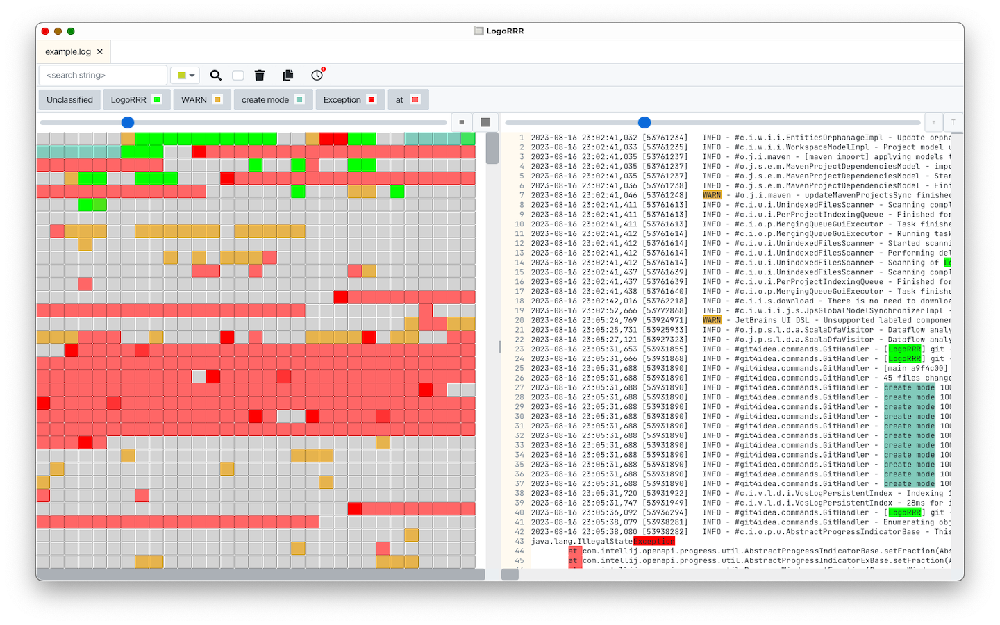

# `LogoRRR`

<table>
  <tr>
    <td>

</td>
<td>

</td>
<td>

</td>
</tr>
</table>

LogoRRR is a powerful desktop application designed to simplify the analysis of text files for recurring patterns. Whether you’re searching for specific events in log files or analysing any other type of text file, LogoRRR makes the process effortless and efficient.

* **Easy Pattern Recognition**: Quickly identify recurring patterns in your text files.
* **Versatile Application**: Perfect for log file analysis, but adaptable to any text file.
* **User-Friendly Interface**: Designed with simplicity and ease of use in mind.

Visit the [www.logorrr.app](https://www.logorrr.app/) for more information.

## Windows installation

The easiest way on Windows to install `LogoRRR` is by [downloading LogoRRR from the Microsoft App Store](https://aka.ms/AAr3sxs).

Alternatively, you can download the latest [Windows installers](https://github.com/rladstaetter/LogoRRR/releases/tag/24.5.1) from the github release page.

## MacOsX installation

`LogoRRR` is available on the OsX [App Store](https://apps.apple.com/at/app/logorrr/id1583786769). You can [download](https://apps.apple.com/at/app/logorrr/id1583786769) and install it securely and certified from there.

Older releases versions are available on the [releases page](https://github.com/rladstaetter/LogoRRR/releases).

## Linux installation

You can install `LogoRRR` from the [flathub store](https://flathub.org/apps/app.logorrr.LogoRRR).

Alternatively, linux installation packages (.deb) can be downloaded [from the github release page](https://github.com/rladstaetter/LogoRRR/releases/tag/24.5.1).

## Features

- **Cross-Platform Compatibility**: Easily use on **Windows, macOS, Linux**.
- **Drag and Drop**: Just drag and drop log files or directories for instant access.
- **Interactive Filtering**: Effortlessly filter log entries to find exactly what you need.
- **Multi-File Handling**: Manage and view multiple log files simultaneously.
- **Zip File Support**: Directly work with zip files - no need to unpack data before analyzing.
- **Real-Time Monitoring**: Stay updated with Unix `tail -f` like functionality for ongoing events.
- **Quick keyboard shortcuts**:  streamline your workflow by using STRG/CMD - F to search
- **Easy export**: Copy your extracted data to the clipboard - to include it in emails for example.
- **Remembers settings**: `LogoRRR` smartly recalls your last files and settings on restart.

Have a look at more [Screenshots](Screenshots.md) which are available [here](Screenshots.md).

## License

This software is licensed under Apache-2 License.

