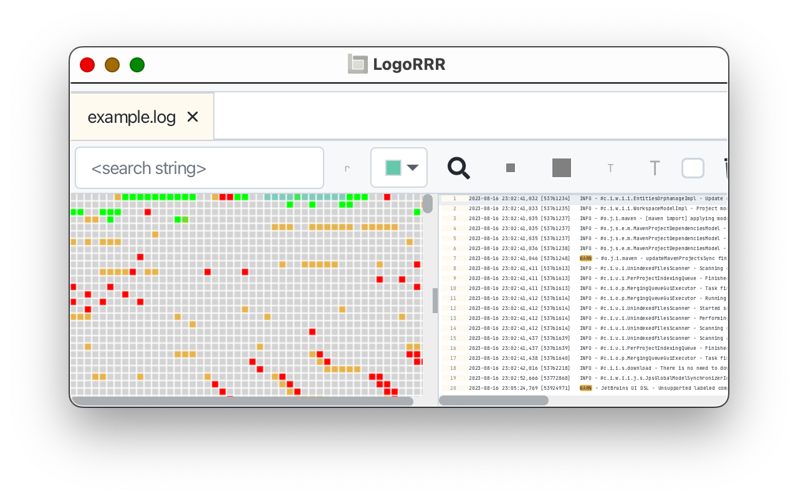
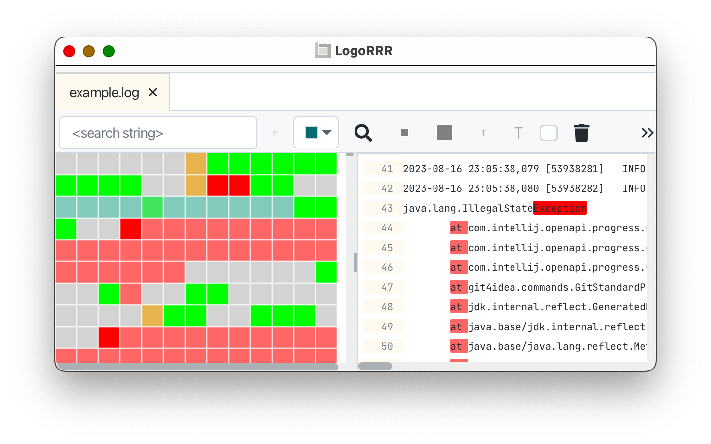
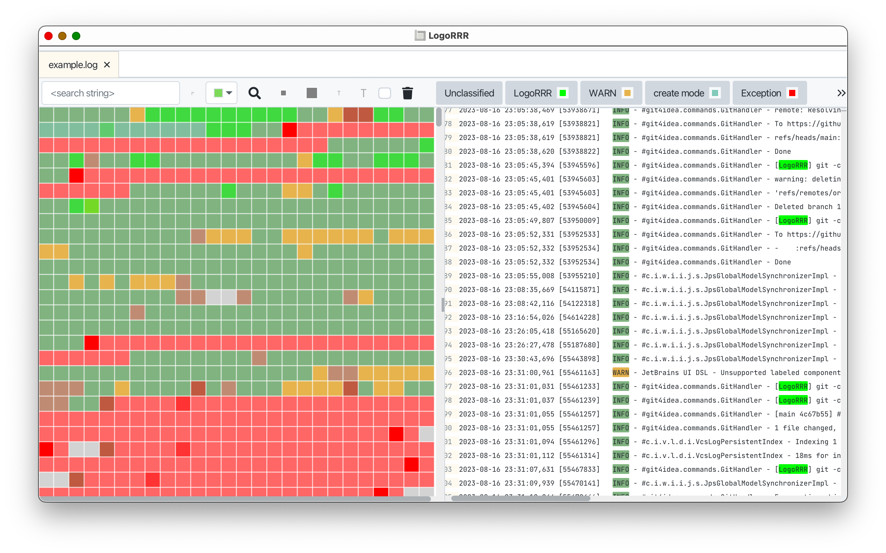
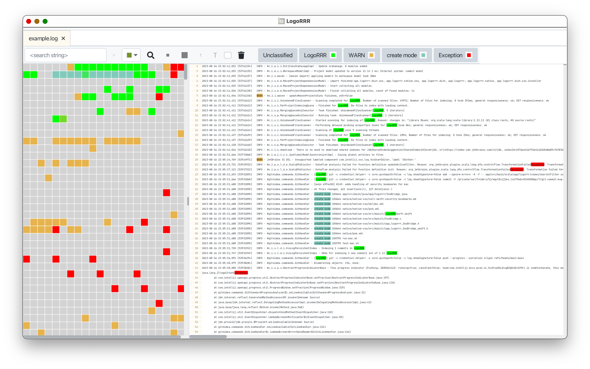

# Usage

You can start `LogoRRR` via double click from the desktop. Add a log file or directories containg log files via drag'n
drop or using the file menu.

## Drop files via mouse to `LogoRRR`

## Use `LogoRRR` as log monitor

## More Screenshots

